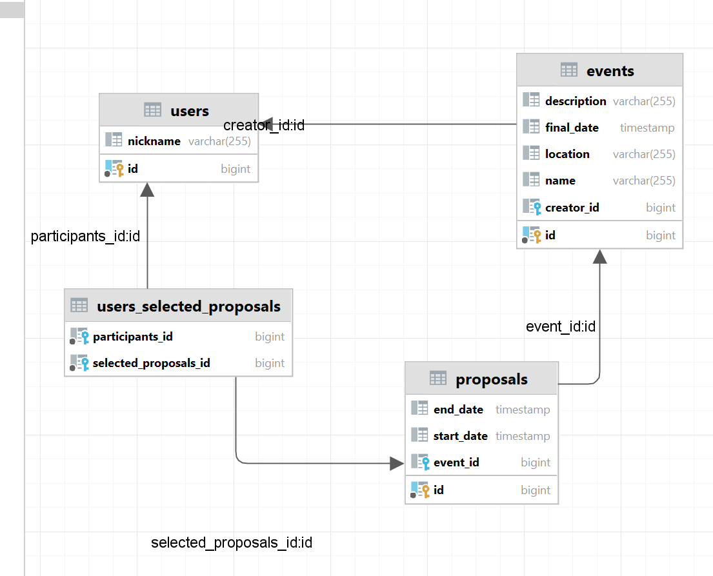

Plan działań:

Model Diagram

Frameworki:

JavaFX
JPA (Hibernate)
PostgreSQL

czy admin moze zaprosic jkaies osoby?? - czy przechowywacgdzies info
o wszystkich zaproszonych uczesnitakch??????????

testing container??

add validation pipe
add dto + validations
add logging interceptor
add http error filter

testing CRUD METHODS???? srsly????

add swagger api doc 

auth??? oauth2.0?? + decorators & guards~~~~