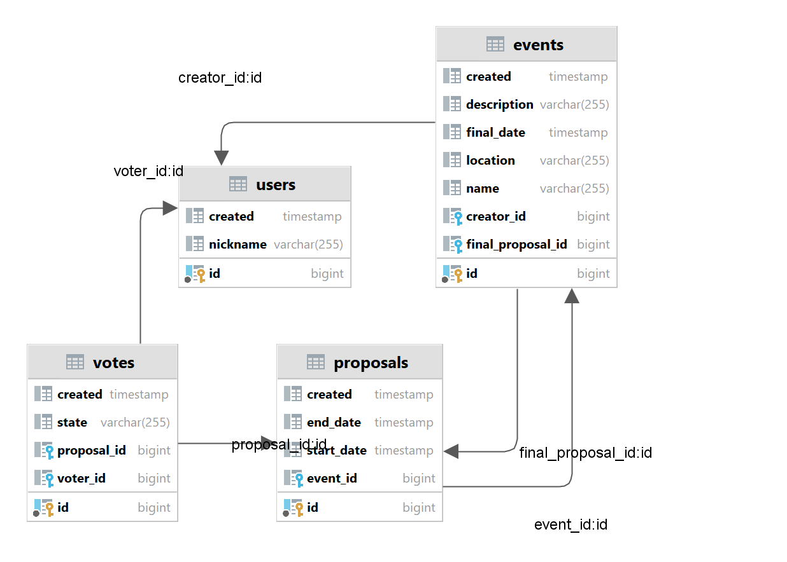

## Projekt aplikacji Doodle

### Opis projektu:

Projekt zakłada stworzenie aplikacji w stylu Doodle, dedykowanej do organizacji wydarzeń i spotkań. 
Główną funkcjonalnością będzie umożliwienie użytkownikom tworzenia wydarzeń z wieloma opcjami terminowymi. 
Zaproszeni uczestnicy będą mieli możliwość głosowania na preferowane terminy, co pozwoli ustalić ostateczną i 
odpowiednią dla wszystkich datę wydarzenia.

Najważeniejsze feature'y:
* tworzenie wydarzeń 
* rejestracja i logowanie użytkowników
* zapisywanie użytkowników na wydarzenia
* głosowanie na preferowane terminy
* wybór ostatecznego terminu wydarzenia
* zarządzanie wydarzeniami - edycja i usuwanie (tylko dla twórcy wydarzenia)

### Plan działań:
* dodanie brakujących testów na backendzie i frontendzie
* zaimplementowanie usuwania eventu
* wybór preferowanego terminu przez twórcę wydarzenia
* dodanie dokumentacji API (Swagger)

### Technologie

* PostgreSQL - baza danych
* Spring Boot, JPA (Hibernate) - backend
* React - frontend

### Schemat bazy danych 



### Uruchomienie aplikacji

#### Baza danych

Aby uruchomic aplikację należy najpierw postawić bazę danych. Proponujemy jeden z dwóch możliwych sposobów:

1) Użycie dokeryzowanej bazy danych:

    Pobieramy obraz postgresa na lokalną maszynę:
    
    ```
    docker pull postgres
    ```
    
    Następnie uruchamiamy kontener wpisując odpowiednią nazwę użytkownika i hasło (może być ta co w przykładzie):
    
    ```
    docker run -d --name postgres-1 -e POSTGRES_PASSWORD=password -e POSTGRES_USER=username -p 5432:5432 postgres
    ```
    
    Możemy sprawdzić czy kontener działa poprawnie
    
    ```
    docker ps
    ```
    
    Należy pamiętać, aby w pliku application.properties zmienić dane logowania do bazy danych na te, które podaliśmy przy uruchamianiu kontenera.
    
    ```properties
    spring.datasource.username=username
    spring.datasource.password="password"
    ```
    
    Jeśli występują problemy, kierujemy do [oficjalnej dokumentacji](https://www.docker.com/blog/how-to-use-the-postgres-docker-official-image/) lub skorzystanie z drugiego sposobu


2) Pobranie PostgreSQL i użycie PgAdmina

    Pobieramy PostgreSQL oraz PgAdmina ze strony [oficjalnej strony](https://www.postgresql.org/download/).
    
    Analogicznie należy pamiętać o zmianie danych logowania w pliku application.properties.
    
    W razie problemów odsyłamy do [poradnika](https://www.youtube.com/watch?v=0n41UTkOBb0&ab_channel=GeekyScript)

#### Backend

Importujemy folder *backend* do Intellij: File -> Open.. Czekamy, aż Gradle pobierze wszystkie zależności i 
zbuduje projekt. Aby uruchomić aplikację korzystamy z polecenia "Run" na klasie CombatSquadApplication (zielona strzałka)

Aplikacja powinna się uruchomić na porcie 8080

Aby przetestować działanie aplikacji korzystamy z test runnera (zielona strzałka obok nazwy klasy testowej)

#### Frontend

Aby uruchomić aplikację frontendową należy najpierw zainstalować node.js (https://nodejs.org/en/)
Projekt został stworzony przy użyciu wersji 16.17.0 jednak będzie działać również na wyższych wersjach.

Importujemy folder *frontend* do Webstorm lub VS Code: File -> Open.. 

Aby pobrać moduły node.js należy wpisać w terminalu:
```
npm install
```
Pozwoli nam to załadować wszystkie potrzebne biblioteki. Następnie wpisujemy:
```
npm start
```

Aplikacja powinna się uruchomić na porcie 3000.
